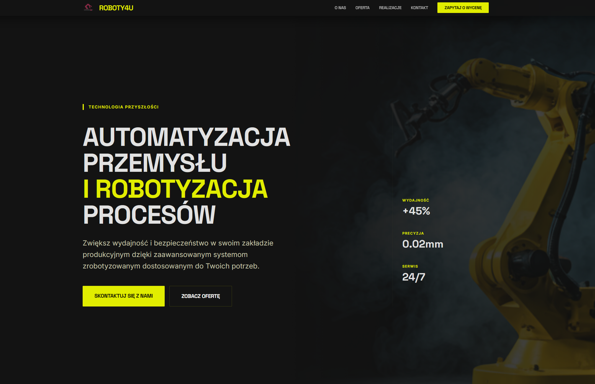
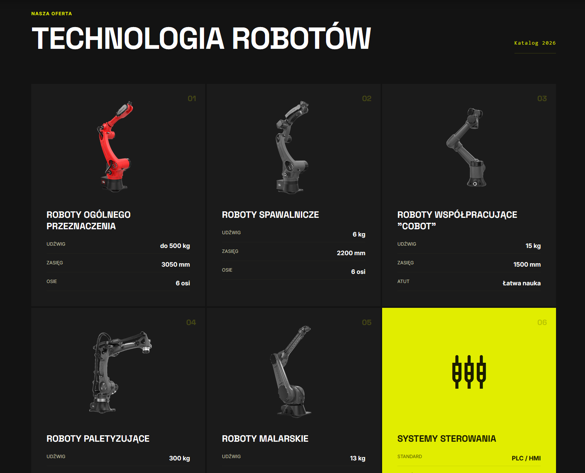
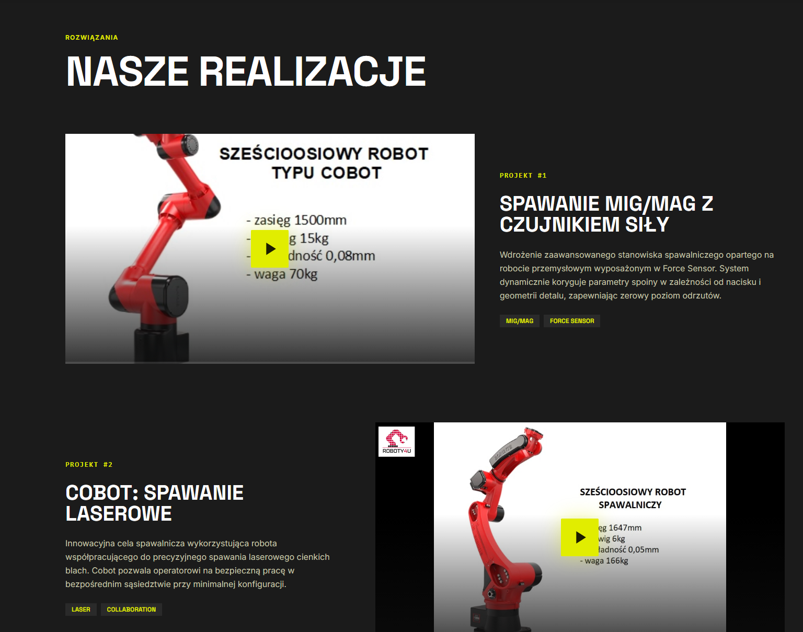
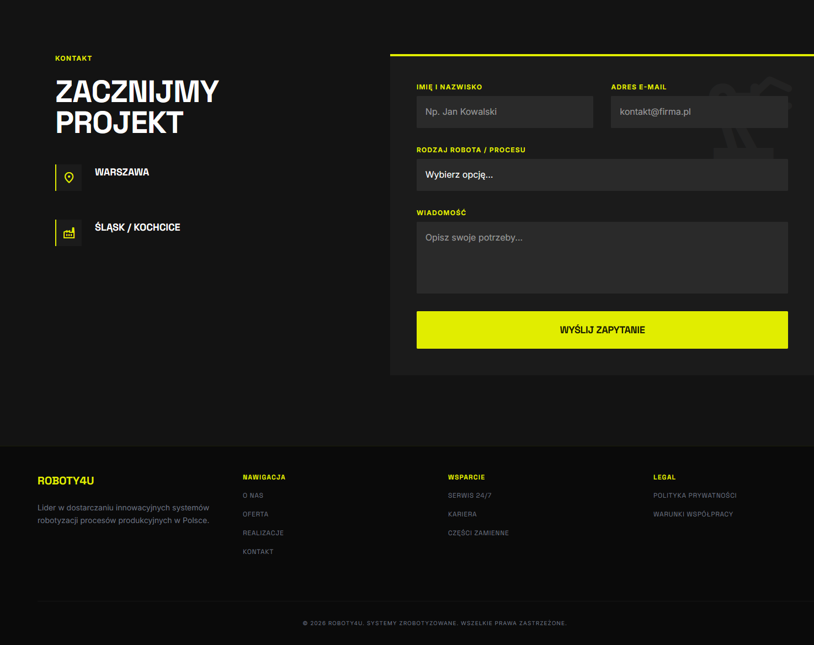

# ROBOTY4U — Strona Internetowa

Firmowa strona internetowa dla **ROBOTY4U** — polskiego integratora systemów zrobotyzowanych dla przemysłu.

---

## O projekcie

Strona typu **single-page** zbudowana w Next.js 16 (App Router), prezentująca pełną ofertę firmy: od robotów spawalniczych po systemy paletyzacji i sterowania. Projekt realizuje autorski system designu **„Kinetic Monolith"** — estetykę przemysłowej sali kontrolnej z dominującym kolorem Signal Yellow (`#e1ed00`) na tle obsydianowej czerni.

### Sekcje

| Sekcja               | Opis                                                                                            |
| -------------------- | ----------------------------------------------------------------------------------------------- |
| **Hero**             | Pełnoekranowy nagłówek z tłem robota, kluczowymi wskaźnikami (wydajność / precyzja / serwis)    |
| **O nas**            | Prezentacja firmy z animowaną fotografią i kafelkami kompetencji                                |
| **Oferta**           | Siatka 6 typów robotów z danymi technicznymi (udźwig, zasięg, osie)                             |
| **Nasze Realizacje** | Alternujący układ z wbudowanymi odtwarzaczami wideo (natywny `<video>`) prezentujący 3 projekty |
| **Kontakt**          | Dane oddziałów Warszawa i Śląsk + formularz zapytania                                           |

---

## Architektura danych

```text
public/
  data/
    nav.json          # Nawigacja i CTA
    hero.json         # Sekcja główna + statystyki
    about.json        # O nas — akapity, cechy firmy
    offer.json        # Katalog robotów ze specyfikacjami
    realizations.json # Realizacje — tytuły, opisy, ścieżki do filmów
    contact.json      # Dane sekcji kontakt (bez danych osobowych)
    footer.json       # Stopka — kolumny linków
  videos/             # Filmy demonstracyjne (MP4)
  images/readme/      # Zrzuty ekranu (podgląd interfejsu)
```

### Podgląd interfejsu









---

## Stos technologiczny

| Technologia      | Wersja | Zastosowanie                              |
| ---------------- | ------ | ----------------------------------------- |
| Next.js          | 16     | Framework (App Router, SSR)               |
| React            | 19     | UI                                        |
| TypeScript       | 5      | Typowanie                                 |
| Tailwind CSS     | 4      | Style                                     |
| `next/font`      | —      | Ładowanie czcionek (Space Grotesk, Inter) |
| Material Symbols | —      | Ikony (CDN Google Fonts)                  |
| HTML5 `<video>`  | —      | Odtwarzacz filmów realizacji              |
